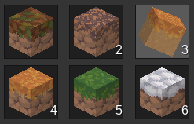

# Item Limit (`item_limit`)
A mod limiting items in player inventories.

> How unfair ! That player has more apples than I can count !

\- me, playing Minetest

Problem solved by this mod.

## About

Help can be found under `config_help.md` in the same folder as this.

Depends on [`modlib`](https://github.com/appgurueu/modlib) and `default`.

**Please note that this mod may not work along well with other mods overriding on_node_drop or the item entity.**

Licensed under the MIT License. Written by Lars Mueller alias LMD or appguru(eu).

## Symbolic Representation

## Links

* [GitHub](https://github.com/appgurueu/item_limit) - sources, issue tracking, contributing
* [Discord](https://discordapp.com/invite/ysP74by) - discussion, chatting
* [Minetest Forum](https://forum.minetest.net/viewtopic.php?t=22346) - (more organized) discussion
* [ContentDB](https://content.minetest.net/packages/LMD/item_limit) - releases (cloning from GitHub is recommended)

## Configuration

<!--modlib:conf:2-->
### `limits`

#### `by_group_name`

Key: Technical group name; value: maximum total count in inventory

#### `by_item_name`

Key: Technical item name; value: maximum total count in inventory

### `player_inventory_lists`

Which player inventory lists to take into account for item limits.
<!--modlib:conf-->
